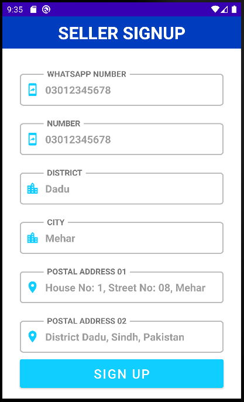

## Show of Skill
## Description
“Profit Bazaar” is kind of like a e-commerce app but only contains mobile phones, bikes and cars, that a client asked me to make. It is for all the users who would enjoy buying one these things from comfort of home.  .
This app is both for sellers and buyers. Sellers can post their product on the app and buyers can view all of these products and buy them. Its a copyrighted app so I can't share the source code. 

## Functionality
User Login 
Seller and Buyer  
Home Page for viewing list of all three types of product(Mobile, Bikes, Cars) 
Post Options for Car, Bikes and Cars 

## Languages and Tools Used
JAVA and Sqlite 
Local and Firebase Database  
Firebase Authentication  
Android Studio IDE  

## Preview:
## Login 

![Screenshot] (ProfitBazaar01.PNG width="10") 
## Sign Up
 
 
 
 
## Home
 
 
## Mobile Post
 
 
## Bikes Post
 
 
## Cars Post
 
 
  
Thanks
## All Copyrights are reserved by the owner.
